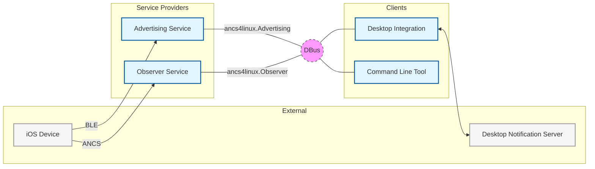
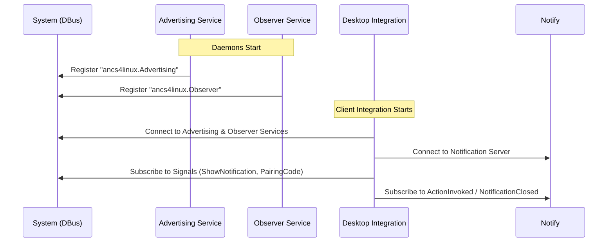
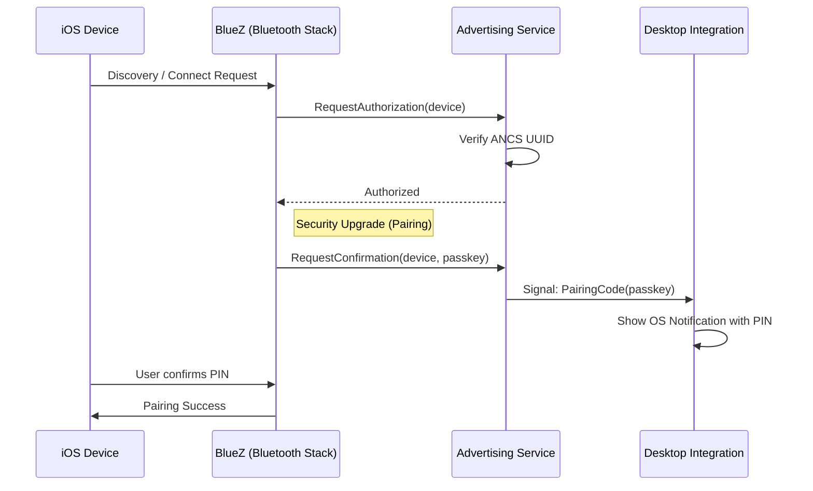
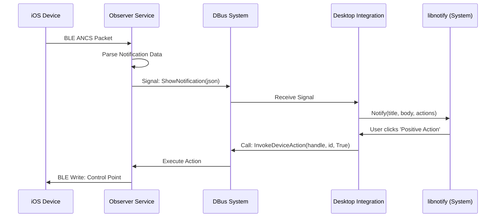
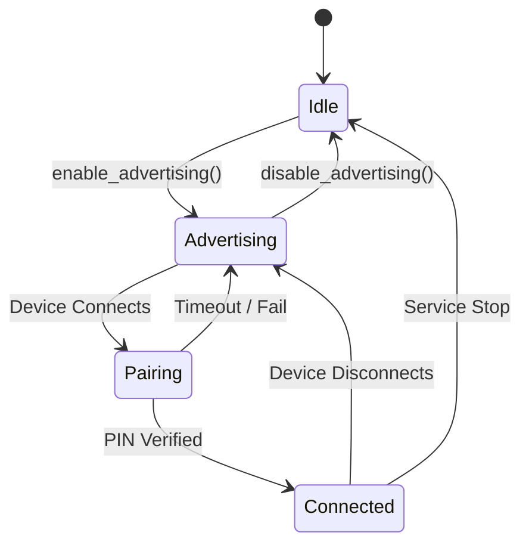

# ancs4linux Architecture

This document provides specialized views of the system architecture to aid in development and maintenance.

---

## 1. Component Map (DBus Interfaces)
This diagram shows the structural ownership of DBus interfaces and how the various tools interact with the background daemons.

---

## 2. Service Initialization
This diagram tracks the startup phase where daemons register their interfaces with the DBus system and clients subscribe to relevant signals.

---

## 3. iOS Connection & Pairing
This diagram details the interaction between an iOS device and the system after services are ready.
- TODO: Security Upgrade: Does it really happen this way?

---

## 4. Notification Sequence
This diagram illustrates the end-to-end data flow when a notification is received from an iOS device.

---

## 5. Advertising & Pairing States
This state machine tracks the lifecycle of the Bluetooth advertisement and pairing process managed by the Advertising service.

